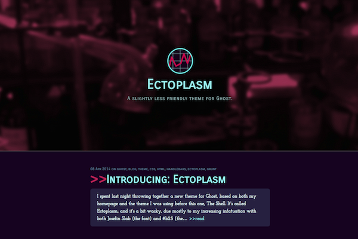

# Ectoplasm

A slightly less friendly theme for [Ghost](http://github.com/tryghost/ghost/) blogs.

It's live [here](http://www.studentific.com).

## How to install

1. Click [here](https://github.com/colinjackson/Ectoplasm/archive/master.zip) to download a zip file of this repository.
2. At ghost.org, navigate to your blog settings (if you're logged in, this should be visible at ghost.org/blogs/BLOGNAME).
3. In the "custom theme" file selection menu, select the downloaded .zip file
4. Click the "save settings" button.

Your blog should now be rendered using the Ectoplasm theme.

## Copyright & License

Copyright (c) 2014 Colin Jackson - Released under The MIT License.
